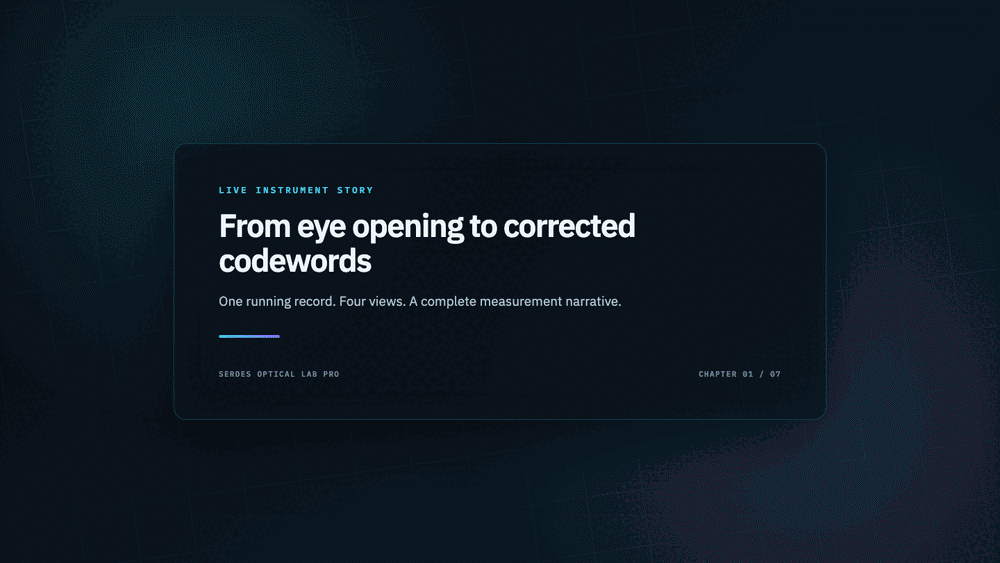
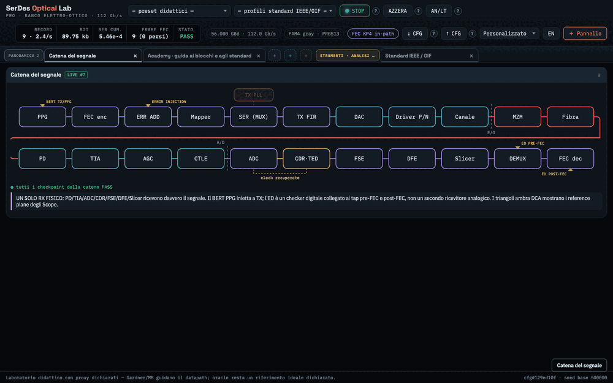
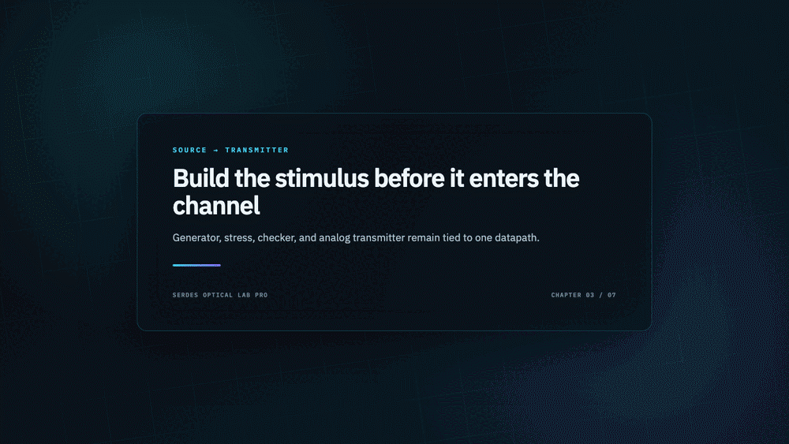
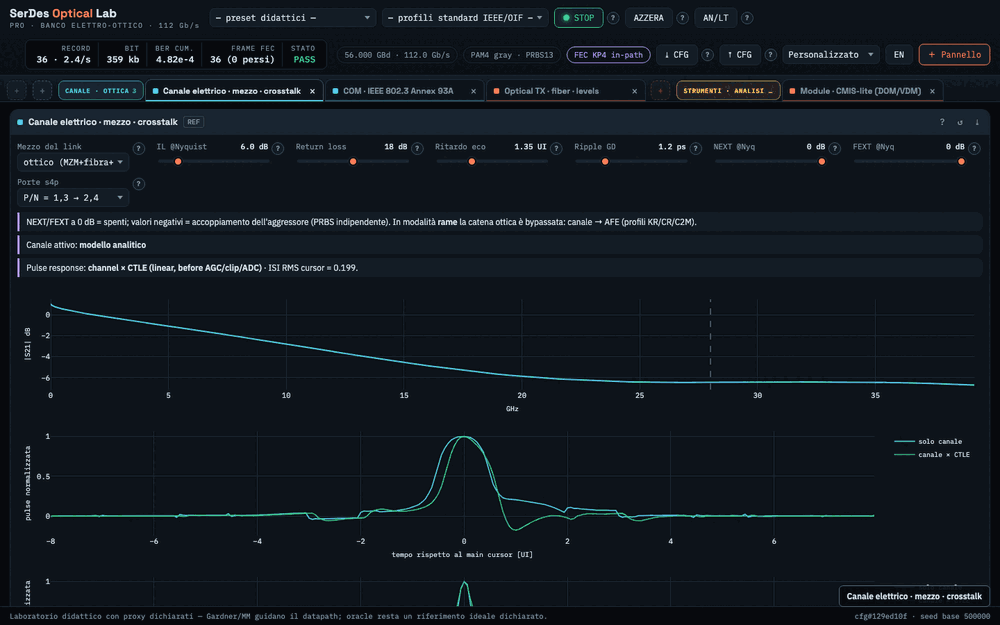
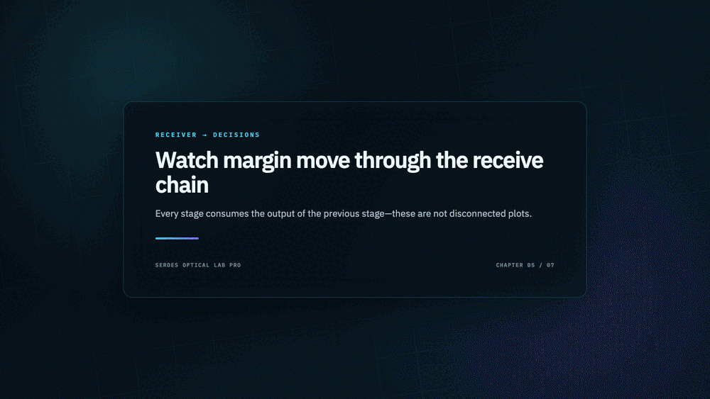
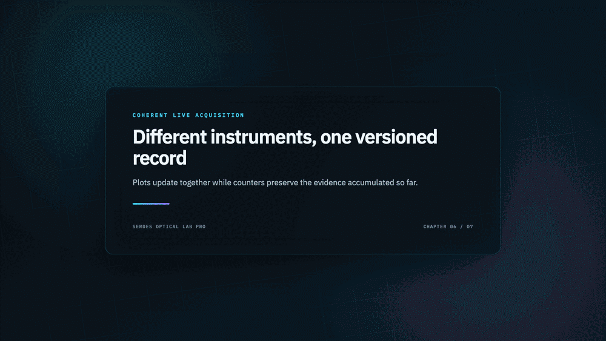
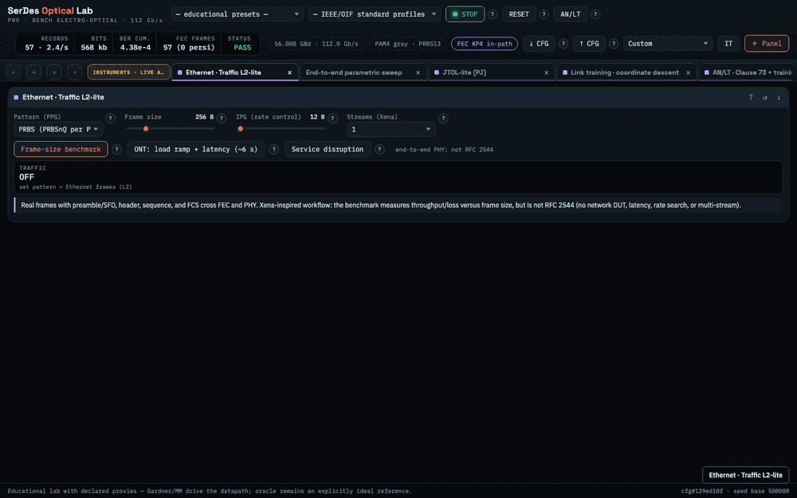

<h1>SerDes Optical Lab PRO</h1>

<h3>From bits to eye diagrams, from channel loss to corrected codewords</h3>

<strong>A physics-backed virtual instrument bench for exploring complete
electrical and electro-optical SerDes links up to the 224G class.</strong>

  
  
  
  
  

  <a href="#quick-start">Quick start</a> ·
  <a href="#visual-tour">Visual tour</a> ·
  <a href="#32-instrument-panels">32-panel reference</a> ·
  <a href="#local-api">API</a> ·
  <a href="#verification-and-quality-gates">Verification</a>

  

  <em>Persistent DCA eye → synchronized waveform → accumulated BER → in-path
  KP4/KR4 FEC codeword analysis.</em>

---

## Why Lab PRO

Most link simulators stop at a waveform or a final BER number. Lab PRO keeps
the **whole evidence chain** visible. One versioned record travels from the
traffic source through TX, channel, optics, receiver, timing recovery, DSP,
decisions, and FEC. Every instrument observes a declared reference plane from
that same record.

| | Product capability | What it gives you |
| --- | --- | --- |
| 🔭 | **Instrument-style analysis** | Coherent DCA, BERT, TIE, spectrum, BER, FEC, traffic, sweep, and JTOL views |
| ⚡ | **Live acquisition** | Fresh noise per record, accumulating counters, confidence intervals, and explicit lock state |
| 🧩 | **One complete datapath** | Electrical, optical, timing, DSP, and coding effects propagate end to end |
| 🧪 | **Measured-channel support** | Touchstone 1.x/2.x S2P and mixed-mode S4P can replace the analytical channel |
| 🎓 | **Explainable controls** | 123 bilingual controls document physics, observables, experiments, and model boundaries |
| ✅ | **Auditable behavior** | 32 panels, signal ledger, checkpoints, paired invariants, and 383 automated tests |

### What you can investigate

- Trace a signal from PRBS or Ethernet frames to pre/post-FEC error counters.
- Compare up to four coherent DCA reference planes on the same acquisition.
- Inject RJ, PJ, DCD, BUJ, SSC, differential noise, and targeted bit errors.
- Move between copper and MZM, EML, DML, or VCSEL optical architectures.
- Separate sensitivity, overload, bandwidth, timing, equalization, and FEC
  limitations instead of reducing them to one score.
- Run parameter sweeps, JTOL-lite, link training, AN/LT, traffic procedures,
  DR4 analysis, and physics invariants from one workspace.

### Choose your path

| If you are a… | Start here | First outcome |
| --- | --- | --- |
| **SerDes designer** | [3-minute FEC demo](docs/QUICK_DEMO.md) | Separate channel, timing, DSP, and coding margin |
| **Optical engineer** | [Channel and optics panels](docs/PANELS.md#channel-and-optics) | Compare MZM/EML/DML/VCSEL and fiber penalties |
| **Student or interviewer** | Academy view, then [panel reference](docs/PANELS.md) | Connect each block, formula, waveform, and metric |
| **Contributor** | [Contribution guide](CONTRIBUTING.md) | Reproduce the baseline and submit a safe change |

### One bench, one datapath

~~~text
PRBS / SSPRQ / Ethernet
          │
          ▼
FEC TX → NRZ/PAM4 → TX FIR → DAC → P/N driver → S-parameter channel
                                                       │
                      ┌────────────────────────────────┘
                      ▼
              modulator → fiber → PD → TIA/AFE → AGC → CTLE → ADC
                                                                  │
                      ┌───────────────────────────────────────────┘
                      ▼
              CDR → FSE → DFE → slicer → FEC RX
                      │                    │
                      └──── eye / TIE ─────┴── BER / GMI / L2 / FEC
~~~

The maintained application lives in <code>labpro/</code> and uses a custom
Tornado/WebSocket frontend. The numerical engine in
<code>serdes_sim/</code> is GUI-independent. The former Streamlit interface
in <code>app/</code> is preserved as a frozen reference.

> **Honest scope.** Lab PRO is a system-level educational framework for
> learning, debugging, and sensitivity analysis. IEEE/OIF procedures and
> profiles identify assumptions and unsupported portions explicitly.
> <code>MODEL PASS/FAIL</code> is never presented as certified compliance.

## Visual tour

Every GIF below is a reproducible recording of the real application. Each tab
change requests live bench data; none of the screens use mocked plots or
precomputed screenshots.

### 1. Workspace, signal chain, Academy, and standards

The signal chain is navigable: clicking a block opens its instrument panel.
Failed checkpoints highlight the responsible block, while amber triangles
show the reference planes currently acquired by DCA scopes.

### 2. Source, BERT, and transmitter

The BERT combines four views: PPG source, TX stress, error checker, and RX
procedures. Its state is shared with the FIR, DAC, P/N driver, TX PLL, and
error-insertion path.

### 3. Channel, COM, and optics

The channel can be analytical or imported from a Touchstone file. COM,
modulator, fiber, and CMIS-lite expose their own physical planes,
measurements, and declared limitations.

### 4. Receiver and DSP

PD, TIA, AGC, CTLE, interleaved ADC, CDR, FSE/DFE, and slicer operate on the
same end-to-end record. They are not disconnected demonstrations.

### 5. Live instruments

DCA EYE/WAVE, TIE, spectrum, BER, and FEC update while acquisition is
running. Counters grow record by record and reset whenever the underlying
physics changes.

### 6. Procedures, training, and audit

Sweep, JTOL-lite, link training, AN/LT, DR4, instrument alignment, the signal
ledger, and the physics audit make both the result and the path that produced
it inspectable.

## Quick start

### Requirements

- Python 3.12;
- NumPy, SciPy, pandas, Tornado, Plotly, and pytest;
- scikit-rf for Touchstone 2.x;
- a modern web browser;
- optional: Playwright and ImageMagick to regenerate the GIFs.

Clone, create an isolated environment, and install the Lab PRO package:

~~~bash
git clone https://github.com/andreagaucho88/Serdes_Simulator.git
cd Serdes_Simulator
python -m venv .venv
source .venv/bin/activate
python -m pip install --upgrade pip
python -m pip install -e .
serdes-lab --port 8640
~~~

Then open [http://localhost:8640](http://localhost:8640). On macOS you can
also double-click <code>avvia_labpro.command</code>.

For development, the legacy UI, and optional references:

~~~bash
python -m pip install -e ".[dev,legacy,reference]"
python -m pytest -m "not slow" -q
~~~

The server binds to localhost. Stop it with <code>Ctrl+C</code>; shutdown
stops the LiveBench cleanly without leaving a traceback.

## Using the workbench

### Top bar

- **Preset** loads one of seven educational scenarios or one of 17 IEEE/OIF
  contexts.
- **RUN / STOP** starts or pauses server-side acquisition.
- **Record** shows the number of accumulated acquisitions.
- **Seed** makes noise, pattern generation, and stress reproducible.
- **IT / EN** switches panels, tooltips, Academy content, and messages.
- **Views** loads a themed workspace: Full bench, Essential, Source and TX,
  Channel and optics, RX and DSP, Live analysis, BERT and traffic, P/N scope,
  or Academy.
- **Reset** restores the selected preset and invalidates dependent
  accumulations.

### Grouped tab workspace

The left palette follows signal flow. Clicking an entry opens it as a tab. A
singleton panel that is already open is activated instead of duplicated.
Scope is intentionally multi-instance so that up to four coherent reference
planes can be compared.

- Drag a tab to reorder it or move it to another group.
- Drag a group to change the section order.
- Use the card buttons to open Academy help, reset local state, or close it.
- Use the left and right arrow keys to move through the active tab group.
- Workspace order, collapsed groups, active tab, language, and plot camera
  survive reloads.
- Hidden panels are lazy: only the active instrument polls and renders.

### Shared control contract

Every slider or selector updates the shared <code>LinkConfig</code>. The
server increments the configuration version, cancels any obsolete worker,
clears counters that can no longer be compared, and broadcasts the new state
over WebSocket. The small hash in the status bar verifies that two panels are
observing the same configuration.

The **?** button next to a control explains:

1. the affected physical plane;
2. the expected effect;
3. the readout to observe;
4. a suggested paired experiment;
5. activation conditions;
6. the model boundary;
7. the API field actually changed.

The **?** button in a card title opens the corresponding Academy page.

## 32 instrument panels

The public workbench contains 32 panels organized by signal flow:

| Domain | Panels |
| --- | --- |
| Overview | Signal chain, Academy |
| Source and TX | BERT, TX FIR/DAC/driver |
| Channel and optics | Electrical channel, COM, modulator/fiber |
| Receiver and DSP | RX front end, PD, TIA, AGC, CTLE, ADC, CDR, FSE/DFE, decisions |
| Live instruments | DCA, jitter/TIE, spectrum, BER, FEC, L2 traffic, CMIS-lite |
| Procedures | Sweep, JTOL, training, AN/LT, standards, DR4, alignment, ledger, physics audit |

Each entry documents purpose, controls, readouts, a suggested experiment, and
the boundary between implemented physics and educational approximation.

**[Open the complete 32-panel reference →](docs/PANELS.md)**

## Educational presets

| Preset | Recommended use |
| --- | --- |
| 112G educational, 2 km at 1550 nm | Course baseline: 56 GBd PAM4 in C-band |
| Back-to-back | Reference without fiber penalty |
| 10 km stress: CD fading | IM/DD notch and equalization limit |
| 100GBASE-LR1 context | O-band, 53.125 GBd, 10 km |
| Severe electrical channel | CTLE/FSE/DFE against 20 dB at Nyquist |
| Noisy receiver | TIA sensitivity and noise budget |
| Link with margin: FEC at work | Observe corrected KP4 codewords |

The 17 standard profiles add 10G, 25G, 50G, 100G, 400G, and 800G Ethernet;
CEI-56G/112G/224G; and P802.3dj contexts. They are not certification presets.

## Persistence and coherence

- <code>LinkConfig</code> is an immutable dataclass with 123 serializable
  fields.
- The server saves configuration, preset, chamber state, and RUN state in the
  laboratory session file.
- The browser saves layout, language, active tab, and plot camera locally.
- Every response carries configuration version/hash and record identity.
- Long-running workers are tied to the version that started them.
- WebSocket disconnects and rapid reloads are consumed without orphaned
  asynchronous futures.
- Config import/export uses a versioned JSON contract.

Use Reset in the UI for a clean session. Before manually removing a session
file, stop the server and keep a copy if its configuration matters.

## Local API

The UI uses the same API that is available for local inspection and
automation:

| Endpoint | Method | Purpose |
| --- | --- | --- |
| <code>/api/state</code> | GET | Configuration, presets, language metadata, RUN state |
| <code>/api/config</code> | POST | Atomic patch of LinkConfig fields |
| <code>/api/config/export</code> | GET | Versioned configuration export |
| <code>/api/config/import</code> | POST | Versioned configuration restore |
| <code>/api/preset</code> | POST | Load an educational or standard profile |
| <code>/api/run</code> | POST | Start or stop acquisition |
| <code>/api/reset</code> | POST | Reset bench state |
| <code>/api/s2p</code> | POST | Validate and apply Touchstone text |
| <code>/api/panel/&lt;name&gt;</code> | GET | Build a panel payload |
| <code>/api/experiment/&lt;name&gt;</code> | POST | Sweep, training, JTOL, traffic, and procedures |
| <code>/ws</code> | WebSocket | State, invalidation, record, and progress updates |

Example:

~~~bash
curl -s http://localhost:8640/api/state
curl -s -X POST http://localhost:8640/api/config \
  -H 'Content-Type: application/json' \
  -d '{"channel_il_nyquist_db": 16.0, "fec_mode": "kp4"}'
~~~

The API is local, unauthenticated, single-user, and does not promise the
stability of a public product API.

## Using the Python engine directly

~~~python
from dataclasses import replace

from serdes_sim import LinkConfig, simulate, sweep

cfg = replace(
    LinkConfig(),
    link_medium="copper",
    channel_il_nyquist_db=16.0,
    fec_mode="kp4",
)

result = simulate(cfg, seed=7, depth="full")
print(result.metrics)
print(result.checkpoints)

curve = sweep(
    cfg,
    field="channel_il_nyquist_db",
    values=[8.0, 12.0, 16.0, 20.0],
    seed=7,
)
~~~

The result contains physical-plane records, metrics, metadata, the signal
ledger, and checkpoints. Source types and repository tests define the exact
contract.

## Repository layout

~~~text
simulatore/
├── labpro/                  Tornado server and Lab PRO frontend
│   ├── server.py
│   └── static/              HTML, CSS, JavaScript, local Plotly bundle
├── serdes_sim/              GUI-independent physical engine
│   ├── blocks/              TX, channel, optics, RX, ADC, DSP, FEC, metrics
│   ├── engine.py            simulate() and sweep()
│   ├── procedures.py        DR4 and versioned procedures
│   ├── config.py            LinkConfig, presets, standard profiles
│   ├── ami.py               IBIS-AMI loader and demo model
│   └── selftest.py          end-to-end smoke test
├── tests/                   numerical, API, UI-contract regression suite
├── tools/
│   └── capture_readme_gifs.py
├── docs/
│   ├── PANELS.md            complete 32-instrument reference
│   ├── QUICK_DEMO.md        guided three-minute product tour
│   ├── VALIDATION.md        verified claims and test evidence
│   └── media/               seven real-UI animated tours
├── app/                     frozen legacy Streamlit interface
├── CONTRIBUTING.md          development and pull-request workflow
├── ROADMAP.md               planned product evolution
└── LICENSE                  MIT license
~~~

## Verification and quality gates

Run from the <code>simulatore</code> directory:

~~~bash
python -m pytest tests -q
python -m serdes_sim.selftest
node --check labpro/static/app.js
python -m compileall -q serdes_sim labpro
git diff --check
~~~

Current validated state: **383/383 tests pass**, physical self-test
**13/13**, JavaScript syntax, Python compilation, and whitespace checks clean.

The additional browser audit traverses all 32 panels in both IT and EN,
verifies singleton and active-tab behavior, all four BERT views, DCA EYE/WAVE,
control propagation, a real Touchstone 2.x upload, and rapid reloads. Numerical
tests also preserve the frozen notebook-v7 baseline.

For the exact evidence and claim boundaries, see the
[validation report](docs/VALIDATION.md).

## Regenerating the GIFs

With the server listening on port 8640:

~~~bash
python tools/capture_readme_gifs.py --base http://127.0.0.1:8640
~~~

The script:

1. launches Playwright using an available Chromium browser;
2. saves the current configuration and RUN state in an isolated browser
   profile;
3. switches the UI to English;
4. visits real tabs and captures 1440 by 900 frames;
5. builds seven optimized 1000 by 625 GIFs with ImageMagick;
6. restores the initial bench state even if capture fails.

Options:

~~~bash
python tools/capture_readme_gifs.py --help
~~~

Do not edit generated GIFs without updating the script. The tour must remain
reproducible and faithful to the current interface.

## Troubleshooting

### The page does not open

Check that the process is running and the port is available:

~~~bash
curl -s http://localhost:8640/api/state
~~~

If port 8640 is occupied, start the server on another port and use the
matching browser URL.

### A panel shows stale data

Check the configuration version/hash in the status bar, allow the current
record to complete, and reload. A parameter change intentionally invalidates
accumulation. If needed, use STOP, Reset, then RUN.

### The link is DOWN

Open Signal chain, Checkpoints and signal ledger, Timing/CDR, and Decisions in
that order. Verify TX output, ADC range utilization, clipping, pattern lock,
and CDR lock.

Missing BER, GMI, or post-FEC metrics while the link is down are correct
behavior.

### A Touchstone file is rejected

Check the extension and port count, strictly increasing frequencies, RI/MA/DB
format, uniform reference impedance, and S4P port-pair mapping. Touchstone 2.x
uses scikit-rf, which must be installed in the same interpreter as the
server.

### GIF regeneration fails

Install Playwright and ImageMagick, and make a Playwright Chromium browser
available in its standard cache. The script emits an explicit error if
<code>magick</code> is unavailable.

## Known limitations

- This is not a compliance instrument and does not replace a golden
  instrument.
- The model is system-level rather than transistor- or layout-level.
- COM and JTOL are educational proxies with declared boundaries.
- CMIS and traffic tests are functional subsets.
- DR4 does not include traceable uncertainty, reflection, or the complete
  polarization-stress space.
- IBIS-AMI behavior depends on each vendor library and contract.
- The Streamlit UI is legacy and receives no new features.

Use [GitHub Issues](https://github.com/andreagaucho88/Serdes_Simulator/issues)
for public bug reports, feature requests, and roadmap discussions.

## License and intended use

Original SerDes Optical Lab PRO code is released under the
[MIT License](LICENSE). Plotly.js, the bundled fonts, and IEEE reference data
retain their respective rights and licenses; see
[Third-party notices](THIRD_PARTY_NOTICES.md).

For design, procurement, or compliance decisions, always correlate the model
with the applicable specification, component data, and traceable
measurements.
